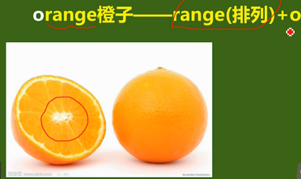

[铁夫破词](http://study.163.com/course/courseMain.htm?courseId=594003)

## 词根
hum（泥土）

+ human（女娲造人）
+ hummock：小山岗，小土丘
+ inhume（埋葬，埋藏）
+ exhume（挖掘）      
   `e`表示动词后缀   
   exit：`it`作为词根时表示：走

## 象形
+ bigwig：大人物，wig（假发）；法官，国王等带假发
+ orange：橙，橘子，o + range；橙子剖开后
    
+ bomb：炸弹；bomber：轰炸机
+ slight：轻微；small＋light
+ dawn：黎明 <= down，黎：表黑暗
+ bundle：捆，束；<= bind；`le`表名次后缀＋小（little）
    新词模仿旧词，元音部分变化
+ dome：圆屋顶；将大写的D放平；home
+ bow：弓，鞠躬；tow：拉拽
+ climb：爬行；c + limb（四肢），两个着地的前肢和胸部组成一个扒下的C字形。
+ cover：c + over

## 东西方熟语互译
+ black sheep：害群之马
+ love me, love my dog：爱屋及乌
+ donkey's year：猴年马月
+ gooseflesh：鸡皮疙瘩

## 三个生活中常见却不曾教授的单词
+ wanna = want to
    I wanna go
    = I want to go
+ goona = going to
    I am gonna to go
    I am going to go
+ gotta = have(got) to
    I gotta go
    I have to go

## 文化差异
red词义变化

1. 亏损
    * red ink/figure 赤字
    * in the black   盈利
2. 血腥，危险
    * red alert  红色警戒 
    * red battle 血腥战争
    * red flag   危险信号旗

红糖 => brown sugar   
红茶 => black tea   
眼红 => green-eyed   
红火 => boom

## 英式vs美式
| 英式 | 美式 |
| --- | --- |
| file | movie(move) | 
| petrol | gasoline | 
| centre | center |
| metre | meter | 
| cheque | check | 

file：薄膜，胶片             => movie：move   
petrol: pe（石头）,trol（油) => gasoline：gas（汽），ol（oil），ine（素）

## 六种构词
1. 相关相仿
2. 复合
3. 缩略
4. 词根词缀
5. 字母象形
6. 拟声

相关相仿示例：
+ back pack
+ sting stink
+ break brake
+ wine vine

复合示例：
+ hi + story = history
+ woe + man = woman
+ woe + full = woeful