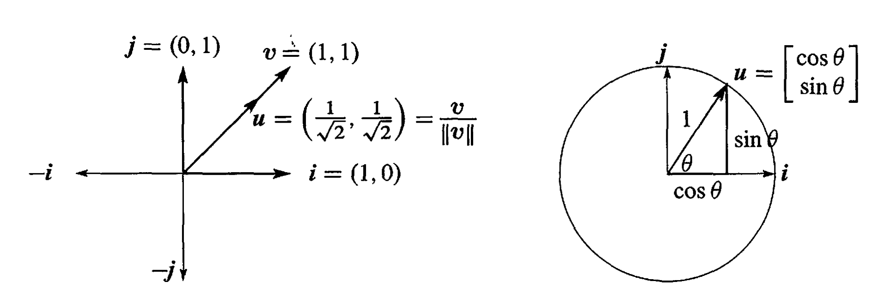
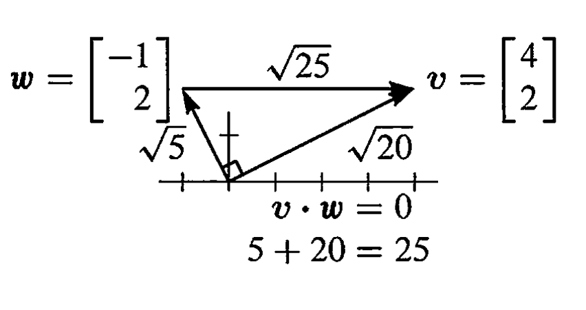
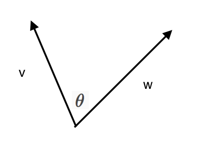
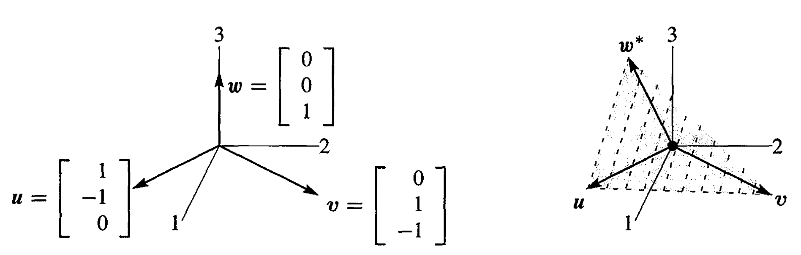

# Vectors and Linear Combinations
A vector is presented by two points, usually the start-point is implicitly set as (0,0), then a vector in plane is presented as $[x \; y]$.
The heart of linear algebra is in two operations--both with vectors:
1. $v+w$
2. $cv$

how we can present a whole three-dimension?
**The number of variables deside the dimension of a space**.
**the linear combination  $cv+dw$ fills the whole two-dimensional plane**.

The real impressive feature of linear algebra is how smoothly it takes that step into $n-dimensional$ space.
vectors basic operations:
$$
\begin{bmatrix}1\\
0\\
3
\end{bmatrix}+4\begin{bmatrix}1\\
2\\
1
\end{bmatrix}-2\begin{bmatrix}2\\
3\\
-1
\end{bmatrix}=\begin{bmatrix}1\\
2\\
9
\end{bmatrix}
$$

# Lengths and Dot Products
How we get the length of a vector? Or in graphically, the length of a line.
0. The dot product or inner product of $v=(v_1, v_2)$ and $w=(w_1,w_2)$ is the number $v\centerdot{w}$. $$v\centerdot{w}=(v_1w_1+v_2w_2)$$
1. The *length*  $\begin{Vmatrix}v\end{Vmatrix}$ of a vector $v$ is the square root of $v\centerdot{v}$: $$length=\begin{Vmatrix}v\end{Vmatrix}=\sqrt{v\centerdot{v}}$$
example:
$$
length=\sqrt{\begin{Vmatrix}x\end{Vmatrix}^{2}}=\sqrt{\begin{bmatrix}1\\
2\\
3
\end{bmatrix}\centerdot\begin{bmatrix}1\\
2\\
3
\end{bmatrix}}=\sqrt{14}
$$

**special case: unit vector, whose length equals one**.
How to get a vector's unit vector?
$$
u = v/\begin{Vmatrix}x\end{Vmatrix} \quad \text{is a unit vector in the same direction as}\; v.
$$

## The Angle Between Two Vectors
**perpendicular vectors, whose dot product is zero**:
$$
\begin{Vmatrix}v\end{Vmatrix}^{2}+\begin{Vmatrix}w\end{Vmatrix}^{2}=\begin{Vmatrix}v-w\end{Vmatrix}^{2}
$$

**Pythagoras**  $\qquad (v_1^2+v_2^2)+(w_1^2+w_2^2)=(v_1-w_1)^2+(v_2-w_2)^2$

**general case**:
$$
v\centerdot{w}=\begin{Vmatrix}v\end{Vmatrix}\begin{Vmatrix}w\end{Vmatrix}\cos{\theta}
$$

**Schwarz Inequality**: $|v\centerdot{w}|\leq\begin{Vmatrix}v\end{Vmatrix}\begin{Vmatrix}w\end{Vmatrix}$
**Triangle Inequality**: $\begin{Vmatrix}v+w\end{Vmatrix}\leq\begin{Vmatrix}v\end{Vmatrix}+\begin{Vmatrix}v\end{Vmatrix}$
We can abstract from the above inequalities and get:
$$
f(g(v, w))\leq{g(f(v),f(w))}
$$

# Matrices
from linear combination to matrix:
$$
c\begin{bmatrix}1\\
-1\\
0
\end{bmatrix}+d\begin{bmatrix}0\\
1\\
-1
\end{bmatrix}+e\begin{bmatrix}0\\
0\\
1
\end{bmatrix}=\begin{bmatrix}c\\
d-c\\
e-d
\end{bmatrix}
 \Leftrightarrow\begin{bmatrix}1 & 0 & 0\\
-1 & 1 & 0\\
0 & -1 & 1
\end{bmatrix}\begin{bmatrix}c\\
d\\
e
\end{bmatrix} \\
Ax=\begin{bmatrix}\\
u & v & w\\
\\
\end{bmatrix}\begin{bmatrix}c\\
d\\
e
\end{bmatrix}=cu+dv+ew
$$

**Dot products with rows**:
$$
Ax=\begin{bmatrix}1 & 0 & 0\\
-1 & 1 & 0\\
0 & -1 & 1
\end{bmatrix}\begin{bmatrix}x_{1}\\
x_{2}\\
x_{3}
\end{bmatrix}=\begin{bmatrix}(1,0,0)\centerdot(x_{1},x_{2},x_{3})\\
(-1,1,0)\centerdot(x_{1},x_{2},x_{3})\\
(0,-1,1)\centerdot(x_{1},x_{2},x_{3})
\end{bmatrix}=b
$$

## Linear Equations
*Old question: *Compute the linear combination $x_1{u}+x_2{v}+x_3{w}$ to find $b$.
*New question: *Which combination fo $u,v,w$ produces a particular vector $b$?

$$
Ax=b\quad\begin{array}{lll}
x_{1}\\
-x_{1} & +x_{2}\\
 & -x_{2} & +x_{3}
\end{array}=\begin{array}{c}
b_{1}\\
b_{2}\\
b_{3}
\end{array}\quad Solution\;\begin{array}{l}
x_{1}=b\\
x_{2}=b_{1}+b_{2}\\
x_{3}=b_{1}+b_{2}+b_{3}
\end{array}
$$

## The Inverse Matrix
$$
Ax=b\;\text{is solved by }\begin{bmatrix}x_{1}\\
x_{2}\\
x_{3}
\end{bmatrix}=\begin{bmatrix}b_{1}\\
b_{1}+b_{2}\\
b_{1}+b_{2}+b_{3}
\end{bmatrix}=\begin{bmatrix}1 & 0 & 0\\
1 & 1 & 0\\
1 & 1 & 1
\end{bmatrix}\begin{bmatrix}b_{1}\\
b_{2}\\
b_{3}
\end{bmatrix}
$$
That is $Ax=b \Leftrightarrow x=Sb=A^{-1}b$.
**Connection with Calculus**:
example 1:
$Ax=b \text{ and } x=Sb \qquad \frac{dx}{dt}=b \text{ and } x(t)=\int_0^t{b}$ 
Integration $S$ is the inverse of differentiation $A$.
example 2:
$$
\text{one-sided "backward differences"} \qquad x(t)-x(t-1)=t^2-(t-1)^2=2t-1\\
\text{Centered difference of  }x(t)=t^2 \qquad \frac{(t+1)^2-(t-1)^2}{2}=2t 
\quad exactly.
$$
Difference matrices are great. Centered is best.

## Cyclic Differences
$$ 
\text{Cyclic} \qquad Cx=\begin{bmatrix}1 & 0 & -1\\
-1 & 1 & 0 \\
0 & -1 & 1 
\end{bmatrix}\begin{bmatrix}x_{1}\\
x_{2}\\
x_{3}
\end{bmatrix}=\begin{bmatrix}x_{1}-x_{3}\\
x_{2}-x_{1}\\
x_{3}-x_{2}
\end{bmatrix}=b
$$
The three equations either have **infinitely many solutions** or else **no solution**.

## Independence and Dependence

**Independence  ** $w$ is not in the plane of $u$ and $v$.
**Dependence  ** $w^{*}$ is in the plane of $u$ and $v$.

$u,v,w$ are independent. No combination except $0u+0v+0w=0 $gives $b=0$.
$u,v,w^{\*}$ are dependent. Other combinations (specifically $u + v + w^{*}$) give $b=0$.

Independent columns: $Ax = 0$ has one solution. $A$ is an **invertible matrix**. 
Dependent columns: $Ax = 0$ has many solutions. $A$ is a **singular matrix**.

