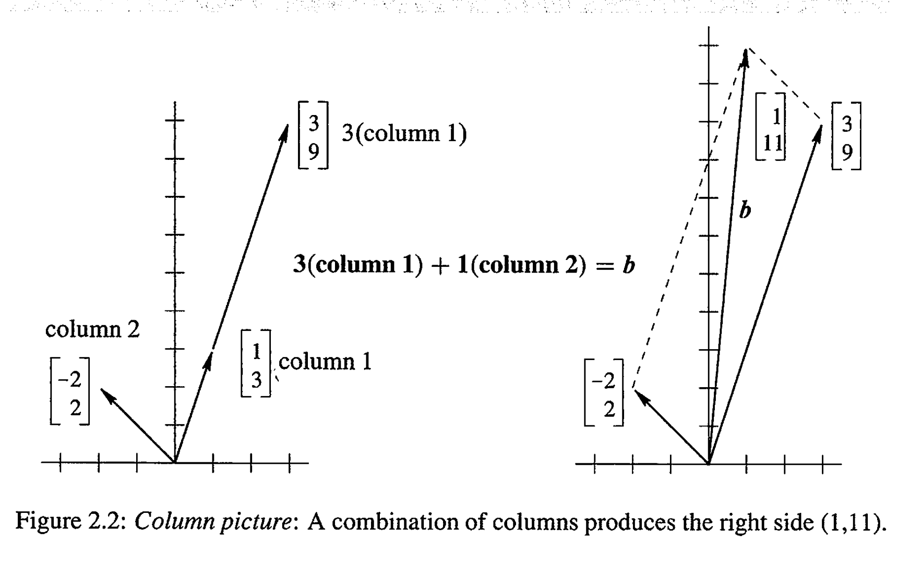
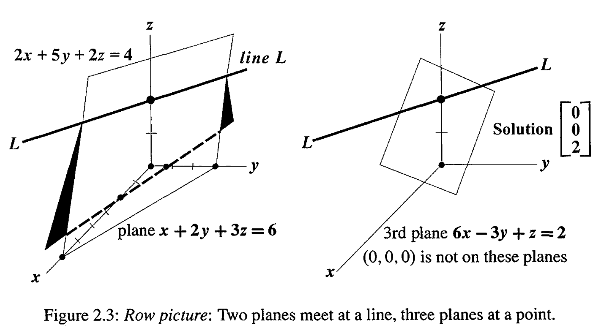
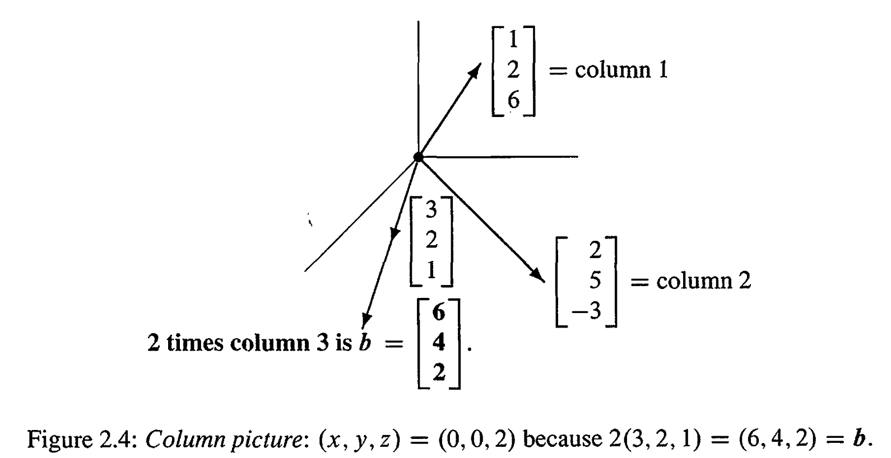
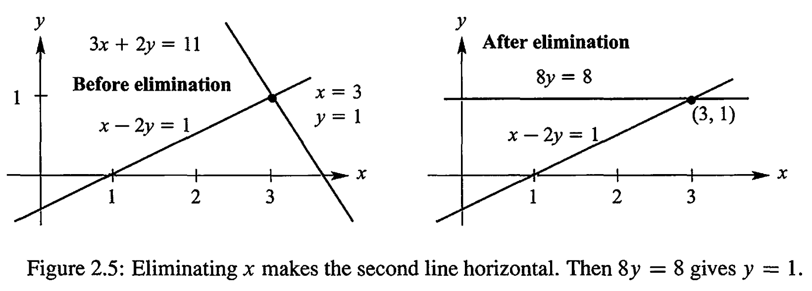

# Vectors and Linear Equations
The central problem of linear algebra is to solve a system of equations.
## Two Picture
**Row Picture:**
$$
\mathbf{\text{Two equations}}\qquad x-2y=1  \\
\mathbf{\text{Two unknows}}\qquad 3x+2u = 11
$$

**ROWS *The row picfure shows two lines meeting at a single point(the solution)*.**

**Column Picture:**
$$
\text{Combinations equals b}\qquad x\begin{bmatrix}1\\
3
\end{bmatrix}+y\begin{bmatrix}-2\\
2
\end{bmatrix}=\begin{bmatrix}1\\
11
\end{bmatrix}=b
$$

**COLUMNS *The column picture combines the column vectors on the left side to produce the vector b on the right side*.**

It is a lot easier to see a combination of four vectors in four-dimensional space, than to visualize how four hyperplanes might possibly meet at a point. (Even one hyperplane is hard enough ... )
**one more example:**
$$
\begin{array}{ccccccc}
x & + & 2y & + & 3z & = & 6\\
2x & + & 5y & + & 2z & = & 4\\
6x & - & 3y & + & z & = & 2
\end{array}
$$

## The Matrix Form of the Equations
**The Matrix form of above equation:**
$$
\begin{bmatrix}1 & 2 & 3\\
2 & 5 & 2\\
6 & -3 & 1
\end{bmatrix}
 \begin{bmatrix}x\\
y\\
z
\end{bmatrix}=\begin{bmatrix}6\\
4\\
2
\end{bmatrix}
$$
**Dot products with rows**
$$
Ax=\begin{bmatrix}(row1)\centerdot x\\
(row2)\centerdot x\\
(row3)\centerdot x
\end{bmatrix}
$$
**Combination of columns**
$$
Ax=x(column1)+y(column2)+z(column3)
$$

# The Idea of Elimination
Elimination produces an *upper triangular system*--this is the goal.**row combinations**.
The visualization of elimination:(let the system become triangular)
$$
\text{Before}\quad \begin{array}{ccccc}
x & - & 2y & = & 1\\
3x & + & 2y & = & 11
\end{array}
\qquad \text{After} \quad \begin{array}{ccccc}
x & - & 2y & = & 1\\
 &  & 8y & = & 8
\end{array}
$$

Ask yourself how that multiplier $l=3$ was found. The first equation contains $\mathbf{1}x$. **So the first pivot was 1** (the coefficient of $x$). The second equation contains $\mathbf{3}x$, **so the multiplier was 3**. Then subtraction $3x-3x$ produced the zero and the triangle.
$$
\mathbf{\text{Pivot= first nonzero in the row that does the elimination}} \\
\mathbf{\text{Multiplier = (entry to eliminate) divided by (pivot)}}
$$
## Breakdown of Elimination
**Example 1 *(Permanent failure with no solution)***.
$$
\begin{array}{ccccc}x & - & 2y & = & 1\\
3x & - & 6y & = & 11
\end{array}\quad\Rightarrow\quad\begin{array}{ccccc}x & - & 2y & = & 1\\
 &  & 0y & = & 8
\end{array}
$$
**Example 2 *(Failure with infinitely many solutions)***.
$$
\begin{array}{ccccc}x & - & 2y & = & 1\\
3x & - & 6y & = & 3
\end{array}\quad\Rightarrow\quad\begin{array}{ccccc}x & - & 2y & = & 1\\
 &  & 0y & = & 0
\end{array}
$$
**Example 3 *(Temporary failure: zero in pivot. A row exchange produces two pivots)***.
$$
\begin{array}{ccccc}0x & + & 2y & = & 4\\
3x & - & 2y & = & 5
\end{array}\quad\Rightarrow\quad\begin{array}{ccccc}3x & - & 2y & = & 5\\
 &  & 2y & = & 4
\end{array}
$$

## Three Equations in Three Unknowns
$$
\begin{array}{rcccccc}
2x & + & 4y & - & 2z & = & 2\\
4x & + & 9y & - & 3z & = & 8\\
-2x & - & 3y & + & 7z & = & 10
\end{array}\quad\begin{array}{c}
\\
\mathbf{Forward}\\
\mathbf{Forward}
\end{array}\quad\begin{array}{ccccccc}
2x & + & 4y & - & 2z & = & 2\\
 &  & 1y & + & 1z & = & 4\\
 &  &  &  & 4z & = & 8
\end{array}\quad\begin{bmatrix}x\\
y\\
z
\end{bmatrix}=\begin{bmatrix}1\\
2\\
2
\end{bmatrix}\quad\begin{array}{c}
\mathbf{Back}\\
\mathbf{Back}\\
\\
\end{array}
$$
+ Column 1. Use the first equation to create zero below the first pivot.
+ Column 2. Use the new equation 2 to create zeros below the second pivot.
+ Columns 3 to n. Keep going  to find all n pivots and triangular $U$.
+ Apply Back substitution on $U$.

# Elimination Using Matrices
We now combine two ideas--elimination and matrices. The goal is to express all the steps of elimination (and the final result) in the clearest possible way.

The $i$th component is a dot product with row $i$ of $A$, which is $[a_{i1} \; a_{i2} \; \dots \; a_{in}]$.
$$
a_{i1}x_1+a_{i2}x_2+\dots+a_{in}x_n \quad\Rightarrow\quad \sum^n_{j=1}a_{ij}x_j
$$
## The Matrix Form of One Elimination Step
What we want:
$$
b=\begin{bmatrix}2\\
8\\
10
\end{bmatrix} \Rightarrow b_{new}\begin{bmatrix}2\\
4\\
10
\end{bmatrix}
$$
$\mathbf{row2-(2\centerdot{row1})}$:

$$
\begin{bmatrix}1 & 0 & 0\\
-2 & 1 & 0\\
0 & 0 & 1
\end{bmatrix}\begin{bmatrix}2\\
8\\
10
\end{bmatrix}=\begin{bmatrix}2\\
4\\
10
\end{bmatrix}\text{Abstract to}\begin{bmatrix}1 & 0 & 0\\
-2 & 1 & 0\\
0 & 0 & 1
\end{bmatrix}\begin{bmatrix}b_{1}\\
b_{2}\\
b_{3}
\end{bmatrix}=\begin{bmatrix}b_{1}\\
b_{2}-b_{1}\\
b_{3}
\end{bmatrix}=E_{21}b
$$
although the operation we want is simple, but the matrix form does more.
because we **omit** some things (the following is the whole expression):
+ Keep the row1 and row3 unchanged
+ substracts 2 time row1 from row2

**Confession** The *elimination matrices* $E_{ij}$ are greate examples, but you won't see them later. They show how a matrix acts on rows. By taking several elimination steps, we will see *how to multiply matrices* (and the order of $E$'s becomes important). **Products and Inverses** are especially clear for $E$'s. It is those two ideas that the book will now use.

## Matrix Multiplication
$$
EA=\begin{bmatrix}1 & 0 & 0\\
-2 & 1 & 0\\
0 & 0 & 1
\end{bmatrix}\begin{bmatrix}2 & 4 & -2\\
4 & 9 & -3\\
-2 & -3 & 7
\end{bmatrix}=\begin{bmatrix}2 & 4 & -2\\
\mathbf{0} & \mathbf{1} & \mathbf{1}\\
-2 & -3 & 7
\end{bmatrix}
$$
Laws:
$$
\mathbf{\text{Associative law is true} }\quad A(BC)=(AB)C \\
\mathbf{\text{Commutative law is false}}\quad Often AB \ne BA
$$

## The Matrix $P_{ij}$ for a Row Exchange
To subtract row $j$ from row $i$ we use $E_{ij}$. To exchange or "permute" those rows we use another matrix $P_{ij}$
$$
\begin{bmatrix}1 & 0 & 0\\
0 & 0 & 1\\
0 & 1 & 0
\end{bmatrix}\begin{bmatrix}2 & 4 & 1\\
0 & 0 & 3\\
0 & 6 & 5
\end{bmatrix}=\begin{bmatrix}2 & 4 & 1\\
0 & 6 & 5\\
0 & 0 & 3
\end{bmatrix}=P_{23}A
$$

## The Augmented Matrix 
Key idea: Elimination does the same row operations to $A$ and to $b$. **We can include $b$ as an extra column and follow it through elimination**.
$$
\begin{bmatrix}1 & 0 & 0\\
-2 & 1 & 0\\
0 & 0 & 1
\end{bmatrix}\begin{bmatrix}2 & 4 & -2 & \mathbf{2}\\
4 & 9 & -3 & \mathbf{8}\\
-2 & -3 & 7 & \mathbf{10}
\end{bmatrix}=\begin{bmatrix}2 & 4 & -2 & \mathbf{2}\\
0 & 1 & -1 & \mathbf{4}\\
-2 & -3 & 7 & \mathbf{10}
\end{bmatrix}
$$
+ **ROWS** Each row of $E$ acts on $[A\; b]$ to give a row of $[EA\; Eb]$.
+ **COLUMNS** $E$ acts on each column of $[A\; b]$ to give a column of $[EA\; Eb]$.