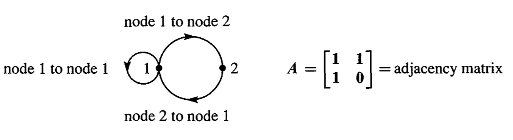

# 矩阵乘法
## 行压缩
一个**行向量右乘**一个矩阵，会把该矩阵压缩成一行：
$$
\begin{bmatrix}1 & 2 & 3\end{bmatrix}\begin{bmatrix}1 & 2 & 3\\
4 & 5 & 6\\
7 & 8 & 9
\end{bmatrix}=\begin{bmatrix}30 & 36 & 42\end{bmatrix}\quad\rightarrow\quad
\begin{array}{c}
1\\
2\\
3
\end{array}\begin{bmatrix}1 & 2 & 3\\
4 & 5 & 6\\
7 & 8 & 9
\end{bmatrix}
$$
## 列压缩
一个**列向量左乘**一个矩阵，会把该矩阵压缩成一列：
$$
\begin{bmatrix}1 & 2 & 3\\
4 & 5 & 6\\
7 & 8 & 9
\end{bmatrix}\begin{bmatrix}
1\\
2\\
3
\end{bmatrix}=\begin{bmatrix}
14\\
32\\
50
\end{bmatrix}\quad\rightarrow\quad
1\begin{bmatrix}
1\\
4\\
7
\end{bmatrix}+2\begin{bmatrix}
2\\
5\\
8
\end{bmatrix}+3\begin{bmatrix}
3\\
6\\
9
\end{bmatrix}
$$

## 扩张
单列乘单行，会扩张成一个更大的矩阵：
$$
\begin{bmatrix}
1\\
2\\
3
\end{bmatrix}\begin{bmatrix}1 & 2 & 3\end{bmatrix}=\begin{bmatrix}1 & 2 & 3\\
2 & 4 & 6\\
3 & 6 & 9
\end{bmatrix}
$$

## 压缩的极限
单行乘单列，会得到一个数：
$$
\begin{bmatrix}1 & 2 & 3\end{bmatrix}
\begin{bmatrix}
1\\
2\\
3
\end{bmatrix}=14
$$

## 单位行变换及其逆
例如将矩阵$A$的第二行减去第一行的2倍：
$$
\begin{bmatrix}1 & 0 & 0\\
-2 & 1 & 0\\
0 & 0 & 1
\end{bmatrix}\begin{bmatrix}1 & 2 & 3\\
4 & 5 & 6\\
7 & 8 & 9
\end{bmatrix}=EA=B
$$
其实上述的描述并不是完整的，还需加上“同时保持其他行不变”。更符合$E$的描述，则需要将“减去第一行的$2$倍”修改成“加上第一行的$-2$倍”。这样整个矩阵$E$就是变得更加明白。
那$E$的逆矩阵该怎么得到呢？

> 描述上可以是“将矩阵$B$的第二行加上第一行的$2$倍”。

从而可以得到逆矩阵的形式：
$$
\begin{bmatrix}1 & 0 & 0\\
2 & 1 & 0\\
0 & 0 & 1
\end{bmatrix}
$$

# Pascal矩阵（杨辉三角矩阵）
Pascal矩阵将其特性，用矩阵的形式表示出来：
$$
\begin{bmatrix}1 &  & &\\
1 & 1 &  &\\
1 & 2 & 2 & \\
1 & 3 & 3 & 1 &
\end{bmatrix}\begin{bmatrix}
1\\
1\\
1\\
1
\end{bmatrix}=\begin{bmatrix}
1\\
2\\
4\\
8
\end{bmatrix} \quad\leftrightarrow\quad  \begin{bmatrix}1 &  & &\\
1 & 1 &  &\\
1 & 2 & 2 & \\
1 & 3 & 3 & 1 &
\end{bmatrix}\begin{bmatrix}
1\\
x\\
x^2\\
x^3
\end{bmatrix}=\begin{bmatrix}
1\\
1+x\\
(1+x)^2\\
(1+x)^3
\end{bmatrix}
$$
Pascal矩阵可以引出超立方体矩阵（hypercube matrix）：
$$
\begin{bmatrix}1 &  & &\\
1 & 1 &  &\\
1 & 2 & 2 & \\
1 & 3 & 3 & 1 &
\end{bmatrix}\begin{bmatrix}1 &  & &\\
1 & 1 &  &\\
1 & 2 & 2 & \\
1 & 3 & 3 & 1 &
\end{bmatrix}=\begin{bmatrix}1 &  & &\\
2 & 1 &  &\\
4 & 4 & 1 & \\
8 & 12 & 6 & 1 &
\end{bmatrix}=H
$$
对$H$矩阵同样进行相似的操作：
$$
\begin{bmatrix}1 &  & &\\
2 & 1 &  &\\
4 & 4 & 1 & \\
8 & 12 & 6 & 1 &
\end{bmatrix}\begin{bmatrix}
1\\
1\\
1\\
1
\end{bmatrix}=\begin{bmatrix}
1\\
3\\
9\\
27
\end{bmatrix} \quad\leftrightarrow\quad  \begin{bmatrix}1 &  & &\\
2 & 1 &  &\\
4 & 4 & 1 & \\
8 & 12 & 6 & 1 &
\end{bmatrix}\begin{bmatrix}
1\\
x\\
x^2\\
x^3
\end{bmatrix}=\begin{bmatrix}
1\\
2+x\\
(2+x)^2\\
(2+x)^3
\end{bmatrix}
$$
对$H$矩阵可以使用以下表格进行递推类比：

| 维度 | 角（corner） | 边（edge） | 面（face） |
| --- | --- | --- | --- |
| 正方形2D | 4 | 4 | 1 |
| 立方体3D | 8  | 12 | 6 |
| 超立方体4D | 16 | 32 | 24 |

# 马尔科夫矩阵
学术化的说法是转移概率矩阵，就我理解就是状态/概率的转移矩阵，一般情况下是随时间而转移（即时间为自变量），表示如下：
$$
A = \begin{bmatrix}0.8 & 0.3 \\   
0.2 & 0.7 
\end{bmatrix}
$$
特点是每列之和为1（定值），乘法特性如下：
初始值：$u_0 = [1\; 0]^T$

| | 第一次流变 | 第二次流变 | 第三次流变 | ... | $n$次后 |  $n+1$次后
| --- | --- | --- | --- | --- | --- | --- | 
| 结果 | $[0.8\; 0.2]^T$ | $[0.7\; 0.3]^T$ | $[0.65\; 0.35]^T$ | ... | $[0.6\; 0.4]^T$ | $[0.6\; 0.4]^T$ |
| 形式 | $Au_0$ | $A^2u_0$ | $A^3u_0$ | ... | $A^nu_0$ | $A^{(n+1)}u_0$ |

每次得到的结构，其和都为1，且数值从第一行流向第二行，最后到达稳定。**同时也显露了一点，对于矩阵$A$，若存在 $Au=u$，则$A$并不一定是单位矩阵**。

# 有向图

其中邻接矩阵$A$中的$a_{ij}$表示从节点 $i$ 到节点 $j$ 的一条边（图中没有从节点2到自身的路径，则出现一个$0$）。
以上的$A$矩阵只表示节点的一次跳跃，若要表示节点的两次跳跃，该用怎样的矩阵表示？

>我的答案是把两个$A$拼起来

那如果要得到节点 $i$ $\rightarrow$ 任意节点 $\rightarrow$ 节点 $j$ 该怎样表示呢？

>$a_{ix}a_{xj}$，连起来表示顺序关系。

所有路径的条数？

>$\sum{a_{ix}a_{xj}}=a_{i1}a_{1j}+\cdots+a_{in}a_{nj}$

上面的公式表示路径的条数。因为有节点间有通路用$1$表示，没通路用$0$表示，可以得到以下两条：

1. 乘积可以表示两条路是否贯通
2. 乘积的和表示两条路径贯通的条数（遍历了所有可能性）

*两条路径的贯通=三节点连通（三节点可能都是同一节点）*
以上的那个求和公式看着颇为眼熟，恰好是$A^2$这个矩阵的元素$a_{ij}$。
$$
A^2 = \begin{bmatrix}1 & 1 \\   
1 & 0 
\end{bmatrix}^2=\begin{bmatrix}2 & 1 \\   
1 & 1 
\end{bmatrix} \qquad \begin{bmatrix}1\;to\;2\;to\;1\;,1\;to\;1\;to\;1\; & 1\;to\;1\;to\;2 \\   
2\;to\;1\;to\;1\; & 2\;to\;1\;to2\;
\end{bmatrix}
$$
若我们继续深究下去将得到：
$$
(A)(A^k)=\begin{bmatrix}1 & 1 \\   
1 & 0 
\end{bmatrix}\begin{bmatrix}F_{k+1} & F_k \\   
F_k & F_{k-1} 
\end{bmatrix}=\begin{bmatrix}F_{k+2} & F_{k+1} \\   
F_{k+1} & F_{k} 
\end{bmatrix}=A^{k+1}
$$
其中 $F_{k+2}=F_{k+1}+F_k$。这赫然便是斐波那契数列的递推公式。

上述内容是由阅读 [Introduction to Linear Algebra](http://www.amazon.com/Introduction-Linear-Algebra-Fourth-Gilbert/dp/0980232716/ref=sr_1_1?ie=UTF8&qid=1439044554&sr=8-1&keywords=introduction+to+linear+algebra+gilbert+strang) 第二章和自己体会所得。

