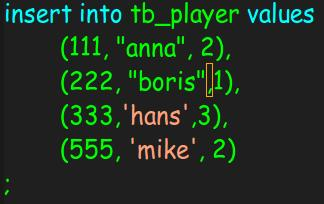

今天在用h2这个内存数据库初始化数据库的时候碰到了这样一个问题，使用如下的语句来初始化：
``` scala
val dbUrl = s"jdbc:h2:mem:test;DATABASE_TO_UPPER=false;INIT=runscript from '${root}/create.sql'\\;runscript from '${root}/init.sql'"
```
create.sql如下：
``` sql
CREATE  TABLE IF NOT EXISTS `tb_player` (
  `id` int(11) NOT NULL AUTO_INCREMENT,
  `nickname` varchar(255) NOT NULL,
  `countryId` int(11) NOT NULL,
  PRIMARY KEY (`id`)
) ENGINE=InnoDB AUTO_INCREMENT=1 DEFAULT CHARSET=utf8mb4;
```
init.sql如下：
``` sql
insert into tb_player values
	(111, "anna", 2),
	(222, "boris",1),
	(333,"hans",3),
	(555, "mike", 2)
;
```
启动sbt项目的时候，报了如下的错：

```
[error] (run-main-0) org.h2.jdbc.JdbcSQLException: Column "anna" not found; SQL statement:
[error] insert into tb_player values
[error] 	(111, "anna", 2),
[error] 	(222, "boris",1),
[error] 	(333,"hans",3),
[error] 	(555, "mike", 2)
[error]  [42122-190]
org.h2.jdbc.JdbcSQLException: Column "anna" not found; SQL statement:
insert into tb_player values
	(111, "anna", 2),
	(222, "boris",1),
	(333,"hans",3),
	(555, "mike", 2)
 [42122-190]
	at org.h2.message.DbException.getJdbcSQLException(DbException.java:345)
	at org.h2.message.DbException.get(DbException.java:179)
....
```
为此我还把sql都复制到mysql客户端中，上面的两条sql都没有错，数据可以插入。之后先确认了 `create.sql` 这个sql是没问题的，就是说创建表对后续的插入数据没有影响。因为不插入数据，项目可以跑起来。所以就把问题定位到 `init.sql` 这条语句，偶然间看到编辑器高亮的把 " 改为 \" 也不行，还会报sql语法错误。又随便修改了一点，偶然间看到编辑器高亮变成如下的了：

用两种引号括起来的字符串显示颜色是不同的，之后把双引号改为单引号句OK了。
之后查了h2的文档在[这里](http://www.h2database.com/html/datatypes.html#varchar_type)就可以看到，只支持单引号的字符串。 
well Done！！
