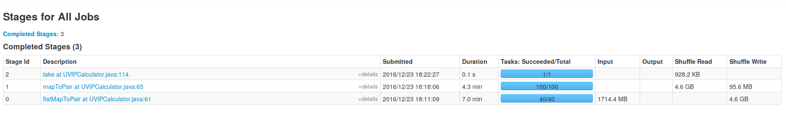
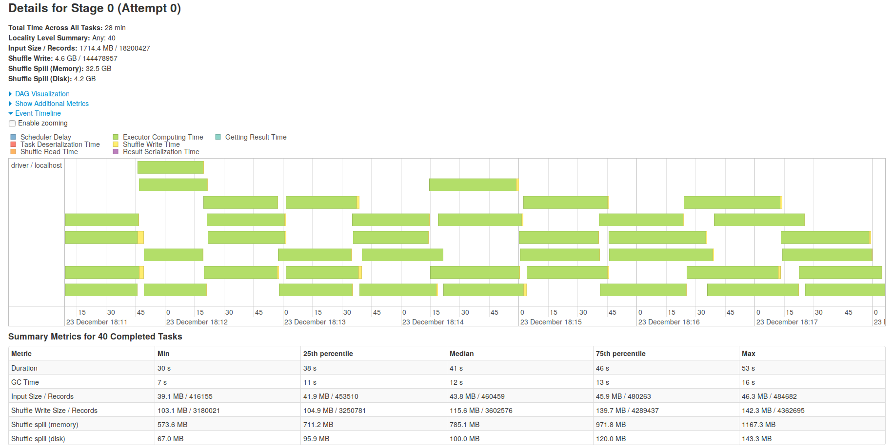
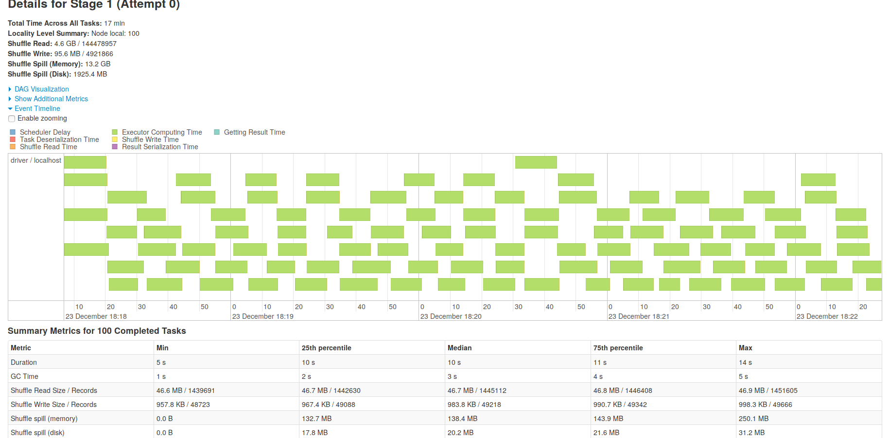
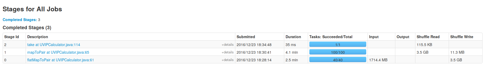
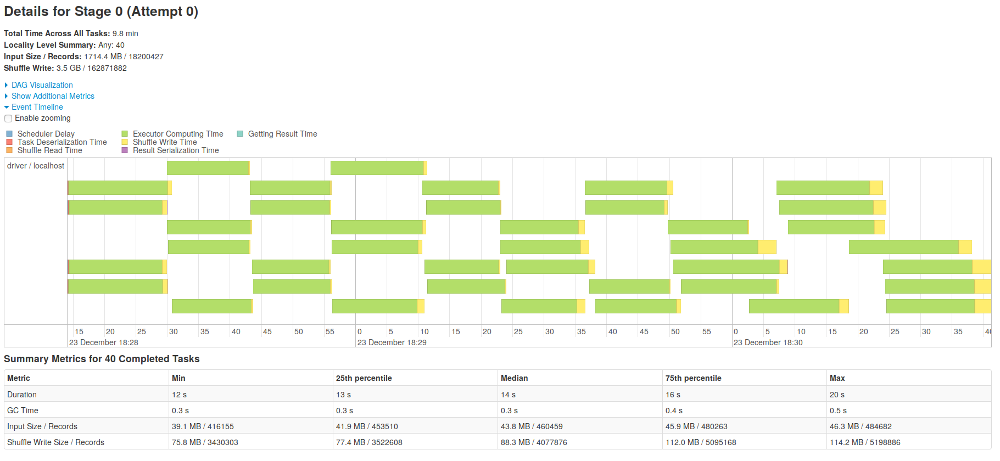
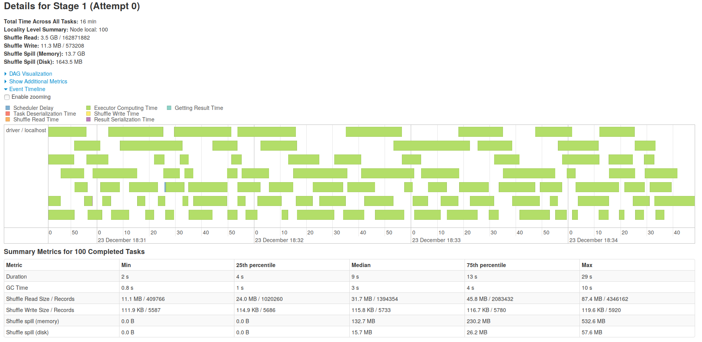

这两周在尝试将mapreduce任务改写成spark任务。
最直接的方式是使用如下对应关系：

mapreduce | spark 
--- | --- 
map | map/flatMapToPair
reduce | groupByKey().mapValues()

可惜数据量上来的时候OOM就出现了，原因在于 `groupByKey` 没有在map端合并数据，导致数据shuffle到executor上的时候非常多，导致了OOM。在写mapreduce的时候这个问题是不会出现的。
网上常见的解决方法就是使用可以在map端合并的函数，比如 `reduceByKey, combineByKey` 等。

# 任务要求
根据日志来输出key（可能是多个字段组合，形成的key）的统计信息（比如pv，cli，uv，ip）。
开发机配置：4核16g，数据量4 * 10 个gzip文件，每个40~50M，一共1,800,000条记录。

# 实现过程
一开始使用的是一个自定义的数据结构将这些信息存储起来，然后使用 `combineByKey`，每次combine的时候修改该结构中的字段值，但很快便出现了OOM，spark-submit使用默认配置。

修改过spark-submit几个参数之后依旧出现，遂弃用自定义数据结构。但弃用之后一个问题来了，如果使用`reduceByKey`没法在同时计算uv,ip这样的指标，就只能再加一步来计算uv，ip。

计算可加性的指标使用如下Pair：
```
key1 pv-num|cli-num
key1 pv-num|cli-num
key2 pv-num|cli-num
```
之后再 `reduceByKey`，对应位置相加。代码跑起来之后没有问题。

而计算uv，ip则使用 `PairRDD#countApproxDistinctByKey`，但是在统计的时候出现了 `Thread 81 spilling in-memory map of 132.8 MB to disk (1 time so far)` ，shuffle不够往内存放，溢写到磁盘了，一下子慢下来了。
调整参数也不能消除这个溢写的问题。苦想了近两天，想出了一个新的方法。

# 新方法计算uv，ip
依然使用 `reduceByKey` 这个方法，因为这个方法性能最好。但是改变Pair（之所以不用单个key是为了和前面计算其他指标使用相同的结构）的设计：
```
# value 留空
key1|uv|id1 ""
key1|uv|id1 ""
key1|ip|1.1.1.1 ""
key1|ip|1.1.1.1 ""
key1|ip|1.1.1.2 ""
```
对于上述的Pair使用 `reduceByKey` 形成以下Pair：
```
key1|uv|id1 ""
key1|ip|1.1.1.1 ""
key1|ip|1.1.1.2 ""
```
再map成以下Pair：
```
key1  1|0
key1  0|1
key1  0|1
```
之后再 `reduceByKey`，类似于计算其他指标。
具体代码如下：
```scala
.reduceByKey((a, b) -> "").keys()
    .mapToPair(key -> {
        int i = key.lastIndexOf("|");
        String value;
        if ("uv".equals(key.substring(i-2, i))) {
            value = "1|0";
        } else {
            value = "0|1";
        }
        return new Tuple2<>(key.substring(0, i-3), value);
    }).reduceByKey(...)
```
这样下来的代码依旧是有溢写到磁盘的现象，虽然多了一个Stage，但比使用 `countApproxDistinctByKey` 要快一些，具体的比较可以自己试以下。
以下是DAG和Stage的耗时和详细图：






令人头疼的spill还是会出现，接下来就看看有没有办法消灭这个。看了很多博客，也没有头绪，一天早上忽然试了一下
在 `reduceByKey` 之前先把数据分区一下：
```scala
.partitionBy(new Partitioner() {
    private int num = 100;
    @Override
    public int numPartitions() {
        return num;
    }
    @Override
    public int getPartition(Object key) {
        if (null == key) {
            return 0;
        } else {
            int i = key.toString().lastIndexOf("|");
            return Utils.nonNegativeMod(key.toString().substring(0, i-3).hashCode(), this.num);
        }
    })
.reduceByKey((a, b) -> "") ....
```
这样跑下来速度果然快了很多，在读取文件阶段快了近3倍，但是在最后一个 `reduceByKey` 的时候还是出现了溢写磁盘，而且出现了数据倾斜。
以下是DAG和Stage的耗时和详细图：






今天在看spark源码的时候，注意到这种计算uv,ip的方法其实在spark源码里有体现，但估计不会有人注意到：

```scala
def distinct(numPartitions: Int)(implicit ord: Ordering[T] = null): RDD[T] = withScope {
    map(x => (x, null)).reduceByKey((x, y) => x, numPartitions).map(_._1)
}
```
上面这个去重方法使用的思想和我这个方法是一致的。

# 接下来
虽然加了分区，性能好了一些，但是数据倾斜却没法避免，还得找找办法。
mapreduce使用spark来改写了，性能确实是有提高，目前提高了30%，我觉得时间缩短主要在spark任务调度延迟低，而且我配的资源比mapreduce要多一些，mapreduce使用了比较高级的数据结构会比较慢点。因为本来这个任务只是把日志读一遍，然后统计一下数据，不会有更多的内存计算在里面，所以改用spark性能提升不会太多，当然这只是我的观点。但30%还是有些不够看，估计还有得改进。


参考博客：

+ http://tech.meituan.com/spark-tuning-basic.html
+ http://tech.meituan.com/spark-tuning-pro.html